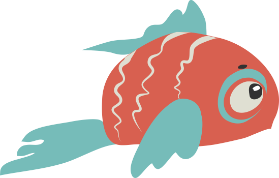
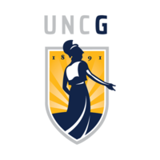
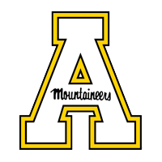

# Hi, I'm Sean. 

##  About Sean
I'm a creative and I'm a developer.  I'm a marketer and I'm a programmer. I'm an business leader and I'm a code monkey. I'm a behavioral analyst and a data evangelist. And I am voted most likely to be accused of split-personality in my career.

Throughout a 20+ year career, I've been a teacher, a writer, an artist, a manager, a consultant, and a developer.  I have served as a VP in one of the largest banks in the US, have led double-digit-sized teams, directed digital marketing strategy and ecommerce for a multinational org, founded and co-founded companies, and designed curriculum used by thousands. I've had my name in the Wall Street Journal, and have consulted organizations across a range of industries on digital strategy, SEO, UX, integrated marketing, and branding, and company growth. 

 

--------------------------------------
 

##  Ok, explain yourself. 
#### <b>Your background is crazy business- and marketing-oriented. You don't exactly fit the typical developer mold.  How in the world did an MBA marketing creative, a former English teacher for goodness sake, come to be a developer?</b>

When push came to shove, I made a better web manager and director of digital by understanding the coding challenges that came with the backlog items. By knowing how to code, by participating in daily scrum meetings, intimately learning agile methodology, and by understanding what would be required to make functionality and enhancements happen, I began to shift into more active development, slowly at first, then more actively as a side hustle, and eventually as a full-fledged active service and skill. 

After a decade+ of active front-end development heavily in HTML and CSS, I expanded my dev skillset to encompass a fuller range of full-stack development including node, express, react, and broad strengthening of my javascript skillset (ES6). 

I couldn't be happier that life and career led me to become as much a developer as I am a marketer, designer, or manager.  

 

--------------------------------------

 

##   Education

 

| University | Degree | Highlights |
|------------|--------|------------|
|  
<b>UNC</b>
 | <b>POST GRADUATE:</b>  Full Stack Developer Program | Currently hold an A+ average; expected completion of program, November 1, 2020. |
|  
<b>UNCG</b>
 | <b>GRADUATE:</b> MBA | Concentrations in both Marketing (digital and ecommerce) and Operations. Received highest honors awarded to a graduate including Bryan Academic Honor Medal (GPA >3.9), Bryan Leadership & Achievement Award, and Wall Street Journal Award - highest single honor given only to one graduating student. Listed in Wall Street Journal among the highest performing MBAs in the nation.|
|  
<b>ASU</b>
 | <b>UNDERGRAD</b> B.Sc. English | Attended on full academic scholarship.|
 &nbsp; 

 

--------------------
### <a href="https://srmchartroom.github.io/bootstrap-responsive-portfolio/index.html">Check out my portfolio</a> to see some of the recent projects I've been working on...
---------------------
 

